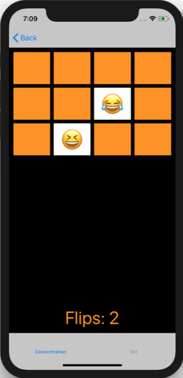
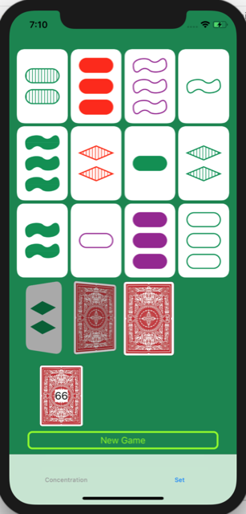

# Set Card Game Implementation
#### My solution to Stanford CS193P Fall 2017 Assignment 4, which is based on assignment 1,2 and 3.

Credit to tatiana.kornilova@gmail.com, I borrowed his ideas for card shading drawing and UI design to my implementation.

## Snapshots:

